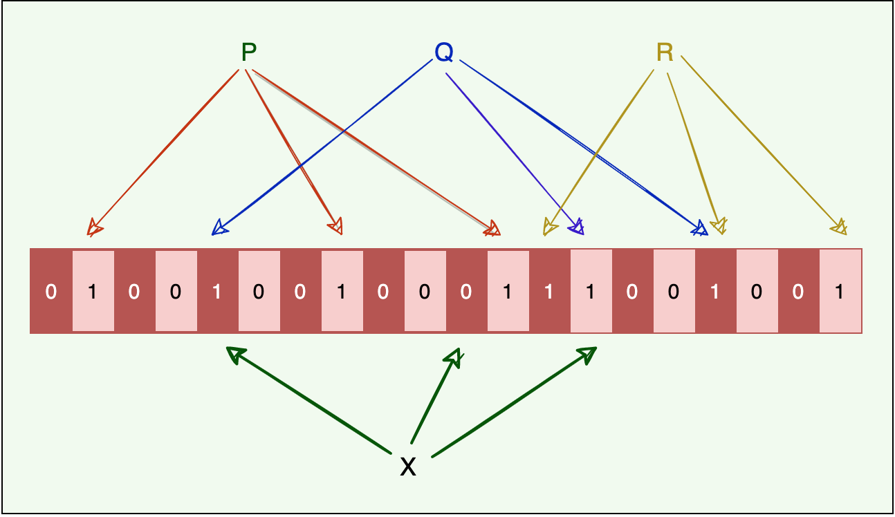

# Bloom Filters

Let's learn about Bloom filters and how to use them.

## Background

If we have a large set of structured data (identified by record IDs) stored in a set of data files, what is the most efficient way to know which file might contain our required data? We don’t want to read each file, as that would be slow, and we have to read a lot of data from the disk. One solution can be to build an index on each data file and store it in a separate index file. This index can map each record ID to its offset in the data file. Each index file will be sorted on the record ID. Now, if we want to search an ID in this index, the best we can do is a Binary Search. Can we do better than that?

## Solution

Use Bloom filters to quickly find if an element might be present in a set.

The Bloom filter data structure tells whether an element **may be in a set, or definitely is not**. The only possible errors are false positives, i.e., a search for a nonexistent element might give an incorrect answer. With more elements in the filter, the error rate increases. An empty Bloom filter is a bit-array of **m** bits, all set to 0. There are also **k** different hash functions, each of which maps a set element to one of the **m** bit positions.

- To add an element, feed it to the hash functions to get k bit positions, and set the bits at these positions to 1.
- To test if an element is in the set, feed it to the hash functions to get **k** bit positions.
  - If any of the bits at these positions is 0, the element is **definitely not** in the set.
  - If all are 1, then the element **may be** in the set.

Here is a Bloom filter with three elements **P**, **Q**, and **R**. It consists of 20 bits and uses three hash functions. The colored arrows point to the bits that the elements of the set are mapped to.

  

- The element **X** definitely is not in the set, since it hashes to a bit position containing 0.
- For a fixed error rate, adding a new element and testing for membership are both constant time operations, and a filter with room for ‘n’ elements requires O(n)O(n) space.