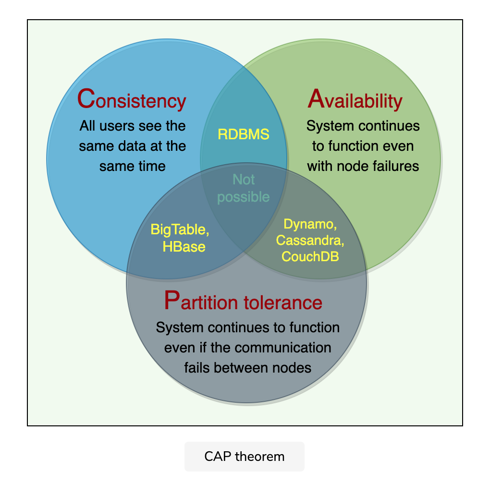

# CAP Theorem
Let's learn about the CAP theorem and its usage in distributed systems.

## Background
In distributed systems, different types of failures can occur, e.g., servers can crash or fail permanently, disks can go bad resulting in data losses, or network connection can be lost, making a part of the system inaccessible. How can a distributed system model itself to get the maximum benefits out of different resources available?

## Solution
CAP theorem states that it is **impossible** for a distributed system to simultaneously provide all three of the following desirable properties:

**Consistency ( C ):** All nodes see the same data at the same time. This means users can read or write from/to any node in the system and will receive the same data. It is equivalent to having a single up-to-date copy of the data.

**Availability ( A ):** Availability means every request received by a non-failing node in the system must result in a response. Even when severe network failures occur, every request must terminate. In simple terms, availability refers to a system’s ability to remain accessible even if one or more nodes in the system go down.

**Partition tolerance ( P ):** A partition is a communication break (or a network failure) between any two nodes in the system, i.e., both nodes are up but cannot communicate with each other. A partition-tolerant system continues to operate even if there are partitions in the system. Such a system can sustain any network failure that does not result in the failure of the entire network. Data is sufficiently replicated across combinations of nodes and networks to keep the system up through intermittent outages.

According to the CAP theorem, any distributed system needs to pick two out of the three properties. The three options are CA, CP, and AP. However, CA is not really a coherent option, as a system that is not partition-tolerant will be forced to give up either Consistency or Availability in the case of a network partition. Therefore, the theorem can really be stated as: **In the presence of a network partition, a distributed system must choose either Consistency or Availability.**

  

We cannot build a general data store that is continually available, sequentially consistent, and tolerant to any partition failures. We can only build a system that has any two of these three properties. Because, to be consistent, all nodes should see the same set of updates in the same order. But if the network loses a partition, updates in one partition might not make it to the other partitions before a client reads from the out-of-date partition after having read from the up-to-date one. The only thing that can be done to cope with this possibility is to stop serving requests from the out-of-date partition, but then the service is no longer 100% available.

[Useful Video](https://youtu.be/k-Yaq8AHlFA)