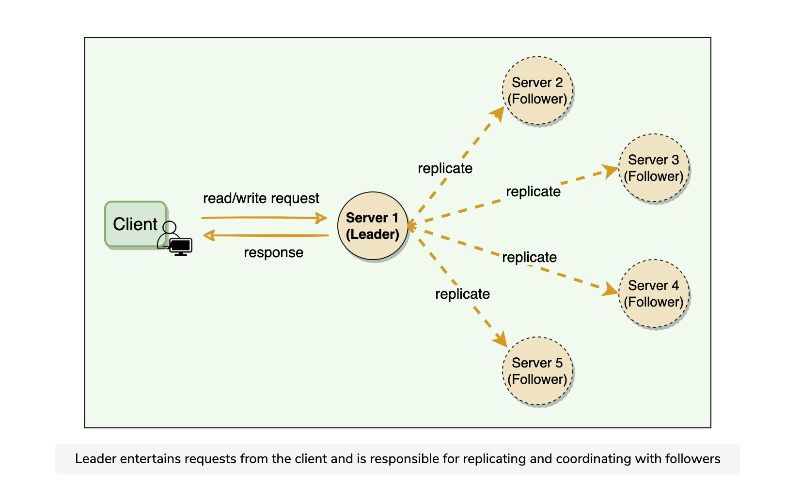

# Leader and Follower

Let's learn about the leader and follower patterns and its usage in distributed systems.

## Background

Distributed systems keep multiple copies of data for fault tolerance and higher availability. A system can use quorum to ensure data consistency between replicas, i.e., all reads and writes are not considered successful until a majority of nodes participate in the operation. However, using quorum can lead to another problem, that is, lower availability; at any time, the system needs to ensure that at least a majority of replicas are up and available, otherwise the operation will fail. Quorum is also not sufficient, as in certain failure scenarios, the client can still see inconsistent data.

## Solution

Allow only a single server (called leader) to be responsible for data replication and to coordinate work.

At any time, one server is elected as the leader. This leader becomes responsible for data replication and can act as the central point for all coordination. The followers only accept writes from the leader and serve as a backup. In case the leader fails, one of the followers can become the leader. In some cases, the follower can serve read requests for load balancing.

  

