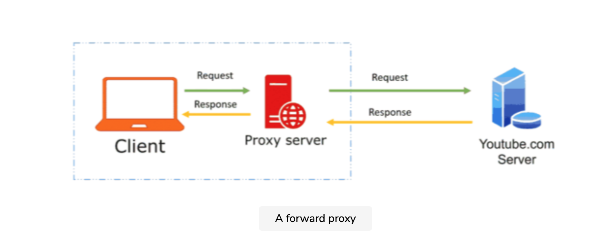
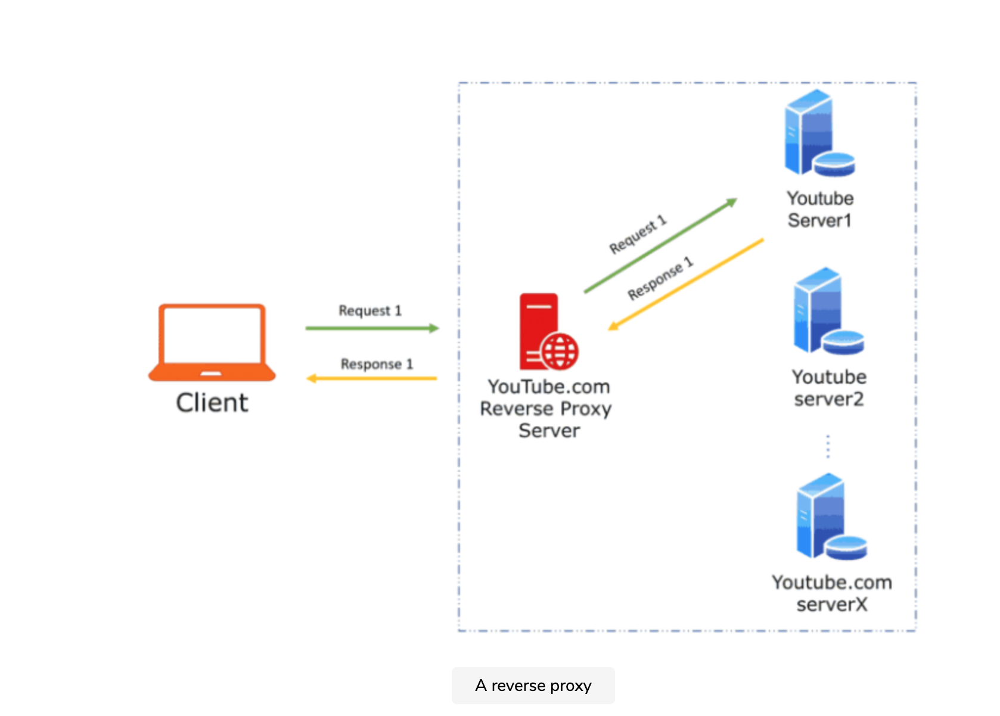

# Proxies

## Sections
- [Proxies](#proxies)
  - [Sections](#sections)
  - [- Summary](#--summary)
  - [What is a proxy server?](#what-is-a-proxy-server)
  - [Reverse Proxy](#reverse-proxy)
  - [Summary](#summary)
--

## What is a proxy server?
A proxy server is an intermediate server between the client and the back-end server. Clients connect to proxy servers to make a request for a service like a web page, file, connection, etc. Essentially, a [proxy server](https://en.wikipedia.org/wiki/Proxy_server) (also known as the forward proxy) is a piece of software or hardware that facilitates the request for resources from other servers on behalf of clients, thus anonymizing the client from the server.

  

Typically, forward proxies are used to cache data, filter requests, log requests, or transform requests (by adding/removing headers, encrypting/decrypting, or compressing a resource). Here are the advantages of the forward proxy:

1. Caching
One of the biggest advantages of proxy is that its cache can serve a lot of requests. The proxy server can cache any data which is not expected to change. If multiple clients access a particular resource, the proxy server can serve it to all the clients without going to the remote server. Caching has advantages of low latency, reduced network traffic, and higher network bandwidth.

2. Anonymity
A forward proxy hides the identity of the client. The final destination server doesn’t know about the client from which the request originated.

3. Traffic control
Proxy servers can help in controlling traffic as all the traffic goes through them, they can block certain content which might not be appropriate for certain reasons. For example, proxy servers in an organization can protect its employees’ machines from certain malicious sites.

4. Logging
As all the traffic goes through a proxy, it has visibility through logs. These logs can be used to identify any patterns or evaluate the need for caching for certain sites.

## Reverse Proxy
A [reverse proxy](https://en.wikipedia.org/wiki/Reverse_proxy) retrieves resources on behalf of a client from one or more servers. These resources are then returned to the client, appearing as if they originated from the proxy server itself, thus anonymizing the server.

  

In the reverse proxy paradigm, as shown above, the reverse proxy server hides the final server that served the request from the client. On the left side of the diagram, the client makes a request for YouTube content; it reaches the YouTube reverse proxy server, which gets the response from one of the YouTube servers and sends the response back to the client.

A reverse proxy, just like a forward proxy, can be used for caching. Here are some other advantages of reverse proxy:

1. Anonymity#
Proxy always brings the benefit of anonymity with it. In the above diagram, the client would never know about the final destination YouTube server. This anonymity protects the destination servers from potential DDoS attacks.

2. Load balancing#
One of the greatest benefits of a reverse proxy is load balancing among the servers. The reverse proxy can use any load balancing algorithm like round-robin, resource-based, etc. Load balancing can help evenly distribute traffic among servers leading to reliability and availability.

3. Experimentation#
Sometimes when a new feature needs to be rolled out, it gets deployed in a canary fashion. For example, YouTube wants to test a new interface, but they are not sure if the customers would like it or not. So instead of releasing the new interface to all the customers, an experiment is launched which shows the new interface to a small percentage of users. The decision to fully launch the feature is determined by the reaction of the customers who were shown the new interface. This experimentation can be easily set up using reverse proxy.

4. Service Routing#
The reverse proxy can act as a router in any micro-services architecture. It can map to actual services running; for example, if a client requests playlists, it directs to YouTube server1 which has the service running for playlists.

## Summary
Proxy and reverse proxy may sound similar but are pretty different in terms of use cases and benefits. Both of them add the element of anonymity; the forward proxy hides the identity of the client, whereas the reverse proxy conceals the identity of the server. So if you want to protect clients in your internal network, put them behind a forward proxy. On the other hand, if you intend to protect your servers, put them behind a reverse proxy.